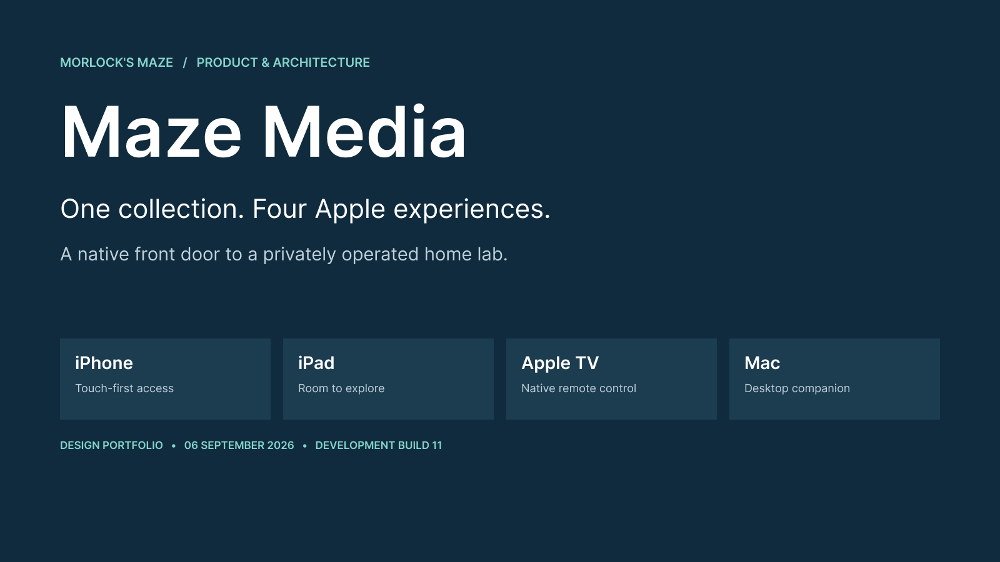
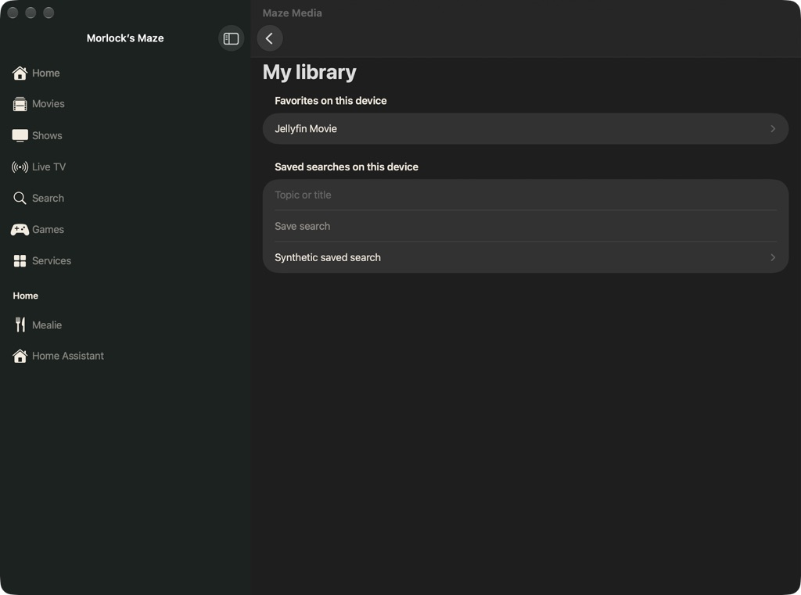
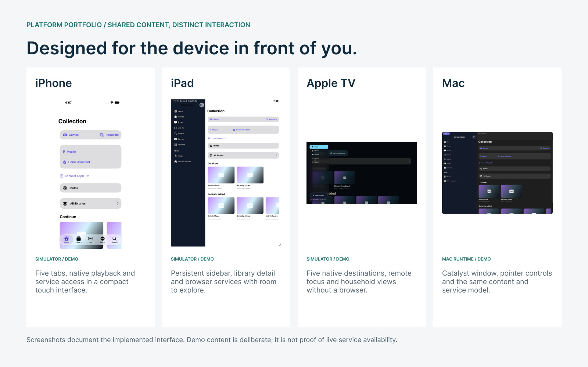
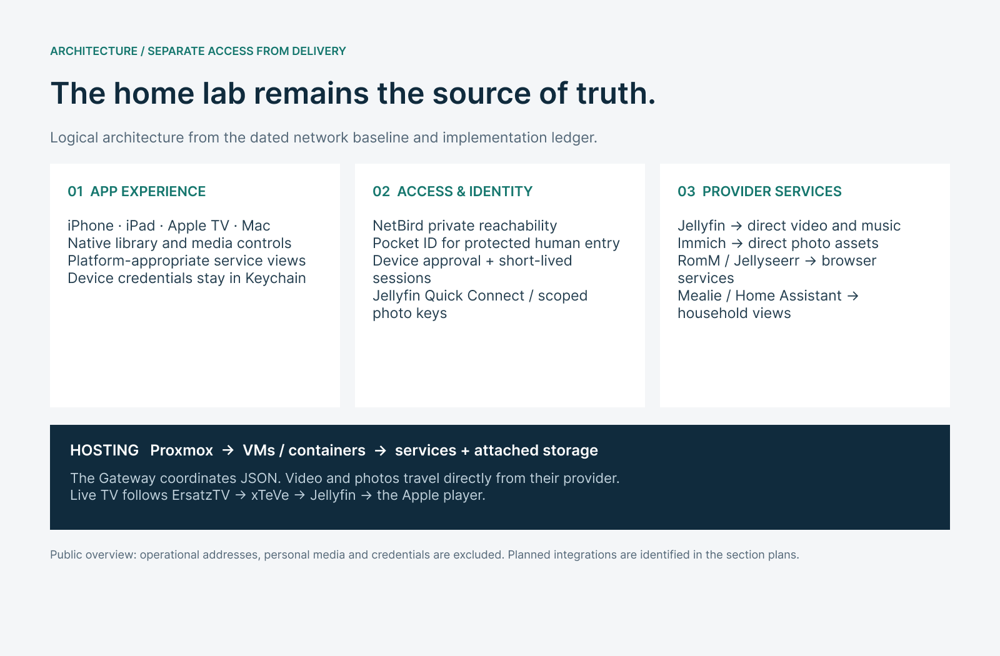

# Maze Media

**Current TestFlight release:** [Version 2.0 (27) — personal library and playback recovery](sections/12-release/build-27/README.md). Verified **Testing** in MorloksMaze Internal on 8 September 2026 for iPhone/iPad, Mac and Apple TV. Testing notes and the project link are saved. Physical-device and Top Shelf acceptance remain pending; expanded Luna discovery is still disabled.

**Current screenshots:** [Home, My library and movie detail](sections/12-release/candidate-4291afd/README.md#screenshots), captured from the same feature code before its build-number update for distribution.

**New in build 13:** [Brass Labyrinth — Morlock’s Maze theme](sections/13-brass-labyrinth/README.md), with original Blender assets, a shared Apple-platform palette and verified app captures.

**A native front door to Morlock’s Maze: media, collections and selected household services across iPhone, iPad, Apple TV and Mac.**

[Read the design brief](publication/Maze-Media-Design-Brief.pdf) · [Open the editable Figma portfolio](https://www.figma.com/design/sfpDlUVIM1j8i4wZ1wjCBC) · [Explore the section plans](#design-and-implementation-plans) · [Review delivery evidence](sections/12-release/EVIDENCE.md)

Maze Media gives the home lab a coherent client experience. Jellyfin remains responsible for its catalog and streams; Immich supplies photos; RomM, Jellyseerr, Mealie and Home Assistant retain their own service roles. The apps organize those capabilities around the device, with native media playback and clear paths back from service views.

This is the **public design and documentation repository**. The [implementation repository](https://github.com/Morlock52/morlocksmaze-media) is separately maintained and may require access. This repository contains no app binaries or turnkey home-lab configuration. Publishing it does not publish a TestFlight build.

## Current candidate captures

**Captured 8 September 2026 · Mac Catalyst · demo content.** [View Home, My library and movie detail](sections/12-release/candidate-4291afd/README.md#screenshots). These are current candidate screenshots; the four-platform portfolio below retains its original capture dates.

## Four application editions

| Edition | Experience | Design reference |
|---|---|---|
| **iPhone** | Five bottom tabs; native video and music; service access optimized for touch | [Screens and plan](sections/02-iphone/README.md) |
| **iPad** | Persistent sidebar, wider catalog/detail views and embedded service navigation | [Screens and plan](sections/03-ipad/README.md) |
| **Apple TV** | Five native destinations, remote focus, AVKit playback and native household views | [Screens and plan](sections/04-tvos/README.md) |
| **Mac** | Catalyst desktop window, pointer interaction and the shared library/service model | [Screens and plan](sections/05-mac/README.md) |

The iPhone and iPad share one iOS target. The Mac edition uses that target through Catalyst. Apple TV has its own native target. Consistency means familiar content and navigation; capabilities remain specific to the platform.

All four overview images are real app captures with demo content. Their [provenance and hashes](assets/screenshots/README.md) are included. The Figma artwork is a publication layout around those captures, not a replacement screenshot or a claim of full feature parity.

## How it fits the home lab

Proxmox, the VM/container environment, CT100 and attached storage provide the service foundation. NetBird supplies private reachability; Pocket ID handles protected human entrances. Approved devices obtain service-specific credentials and short-lived sessions. Native players receive video directly from Jellyfin, and photo assets come directly from Immich. The Media Gateway coordinates JSON rather than carrying media bytes.

Mealie and Home Assistant have dedicated device-authorized app origins that were checked on iPhone and iPad over Wi-Fi with NetBird off. That finding does not extend automatically to RomM, Jellyseerr, Immich, cellular access or first-time enrollment. The [route map](sections/10-home-lab/ROUTES.md) explains those distinctions.

The architecture combines the dated September 4 network baseline with later implementation records. Public diagrams preserve service responsibilities and trust boundaries while omitting private IPs, management endpoints, credentials and personal media.

## Design and implementation plans

Each section has its own folder, design narrative and separately maintained `PLAN.md` with work sequence and acceptance criteria.

| Section | Design narrative | Section plan |
|---|---|---|
| 01 · Product vision & design system | [Read](sections/01-product/README.md) | [Plan](sections/01-product/PLAN.md) |
| 02 · iPhone edition | [Read](sections/02-iphone/README.md) | [Plan](sections/02-iphone/PLAN.md) |
| 03 · iPad edition | [Read](sections/03-ipad/README.md) | [Plan](sections/03-ipad/PLAN.md) |
| 04 · Apple TV edition | [Read](sections/04-tvos/README.md) | [Plan](sections/04-tvos/PLAN.md) |
| 05 · Mac edition | [Read](sections/05-mac/README.md) | [Plan](sections/05-mac/PLAN.md) |
| 06 · Library, video, music & live TV | [Read](sections/06-library-playback/README.md) | [Plan](sections/06-library-playback/PLAN.md) |
| 07 · Games & media requests | [Read](sections/07-games-requests/README.md) | [Plan](sections/07-games-requests/PLAN.md) |
| 08 · Photos, books & saving content | [Read](sections/08-photos-reading/README.md) | [Plan](sections/08-photos-reading/PLAN.md) |
| 09 · Mealie & Home Assistant | [Read](sections/09-household/README.md) | [Plan](sections/09-household/PLAN.md) |
| 10 · Home-lab architecture & network integration | [Read](sections/10-home-lab/README.md) | [Plan](sections/10-home-lab/PLAN.md) |
| 11 · Device identity, enrollment & session design | [Read](sections/11-identity/README.md) | [Plan](sections/11-identity/PLAN.md) |
| 13 · Brass Labyrinth theme | [Read](sections/13-brass-labyrinth/README.md) | [Plan](sections/13-brass-labyrinth/PLAN.md) |
| 12 · Version history, evidence & delivery | [Read](sections/12-release/README.md) | [Plan](sections/12-release/PLAN.md) |

## Capability snapshot

| Capability | Current implementation | Remaining boundary |
|---|---|---|
| Video, shows, saved videos and live TV | Jellyfin catalog and native playback | Broad format, sustained playback and final per-device controls acceptance |
| Music | Jellyfin audio library/player | Music Assistant is a separate integration |
| Games and requests | RomM/Jellyseerr browser destinations on touch/Mac | Exact game launch/input and native TV equivalents need further work |
| Photos | Immich grid/detail and scoped key provisioning | Private connectivity, write-back and TV counterpart |
| Recipes and household states | Mealie/HA browser views on touch/Mac; native TV views | Cellular, long-session and first-enrollment coverage |
| Books, audiobooks, downloads and saving back | Planned client features; service configuration alone is not reader or transfer functionality | Complete reader, permissions, transfer and conflict workflows |

## Version and release checkpoint

**Theme checkpoint, September 6, 2026:** Build 13 is installed locally across all four editions; iOS and tvOS are **Testing** in the existing internal TestFlight group. [Current theme evidence](sections/13-brass-labyrinth/VERIFICATION.md) separates device tests, Apple processing and tester availability.

**Earlier portfolio checkpoint.** Build 9 is the last recorded TestFlight release. Development build 10 added household access and automatic setup work. Build 11 added shared video controls and local Mac delivery. The iPhone’s controls test passed twice; the Mac has passing unit checks and direct mouse verification. The final Mac automated run was interrupted, and iPad/TV release checks remain open.

See the [version chronology and evidence](sections/12-release/EVIDENCE.md) for passed, skipped, failed and interrupted results. This portfolio does not claim that all tests passed, all services work without NetBird, or every content type is implemented on every device.

## Publication assets

- [Print-ready design brief](publication/Maze-Media-Design-Brief.pdf) — a compact, searchable review document.
- [Editable Figma portfolio](https://www.figma.com/design/sfpDlUVIM1j8i4wZ1wjCBC) — cover, platform overview and architecture boards.
- [Figma export manifest](assets/figma/manifest.json) — stable node references and local export files.
- [Original screenshots](assets/screenshots/README.md) — capture method, dates and source hashes.
- [Publication style](sections/01-product/PUBLICATION-STYLE.md) — typography, color and editorial rules.
- [References](REFERENCES.md) — project evidence and primary provider documentation.

## Maintaining this portfolio

Update the relevant section before changing the summary. Keep proposed work in its plan, record evidence in the release section, and replace screenshots only with a dated capture of the reviewed interface. Build the PDF with `python3 scripts/build_pdf.py` after installing `requirements-docs.txt`. Run `python3 scripts/check_docs.py` to verify local links and capture hashes.

No open-source license is granted by this design publication. Third-party service names belong to their respective projects. The apps integrate those projects; this portfolio does not imply their endorsement.
