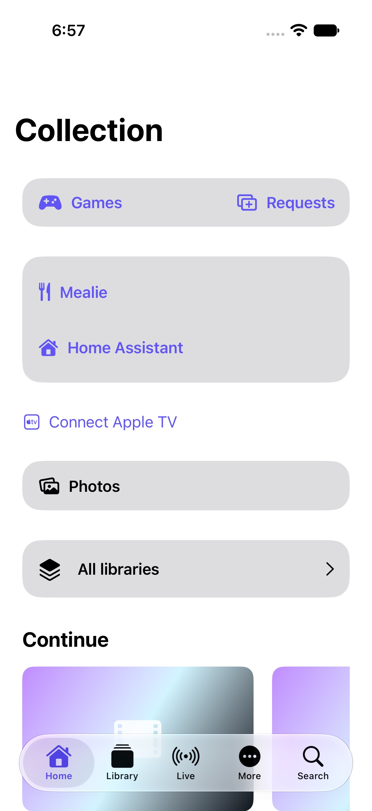
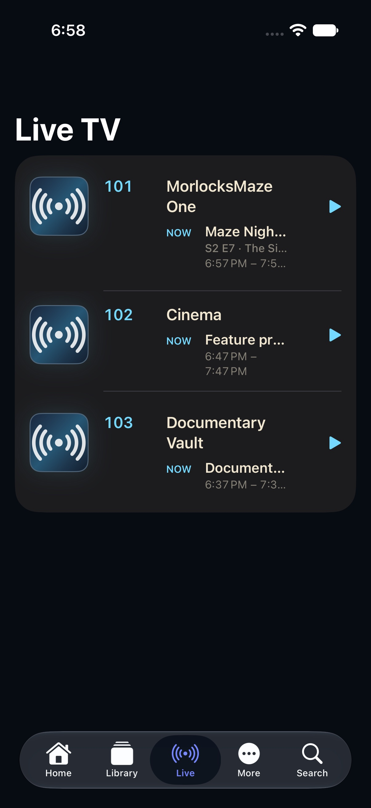
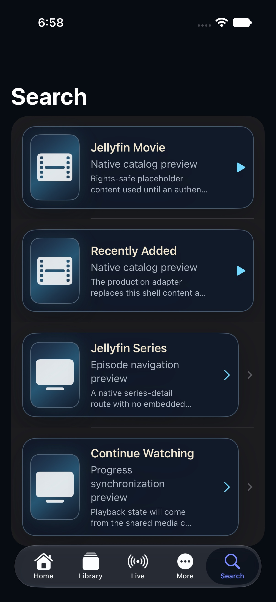

# iPhone edition

> A compact, touch-first entrance to the library and household services.

[Portfolio overview](../../README.md) · [Section plan](PLAN.md)

## Current design

The iPhone edition uses Home, Library, Live, More and Search as its five bottom tabs. Home provides direct entry to collections and supported services. Jellyfin supplies movies, shows, saved videos and music; the app presents native playback. RomM and Jellyseerr use an embedded service browser, while Mealie and Home Assistant appear on the main menu.

## User journey

Home → All libraries → collection → item → Play. In the service browser, Back and Forward move through the service; Done returns to Maze Media. Home → Connect Apple TV approves the television’s short-lived household pairing code.

## Design decisions

- Keep primary navigation reachable without scrolling.
- Show video settings in a stable controls panel.
- Keep saved-video folder navigation within Jellyfin; the folder named Youtube is not a separate YouTube integration.

## Screen reference

*Simulator capture with demo content, September 5, 2026.*

*Simulator capture with demo content, September 5, 2026.*

*Simulator capture with demo content, September 5, 2026.*

*Simulator capture with demo content, September 5, 2026.*
