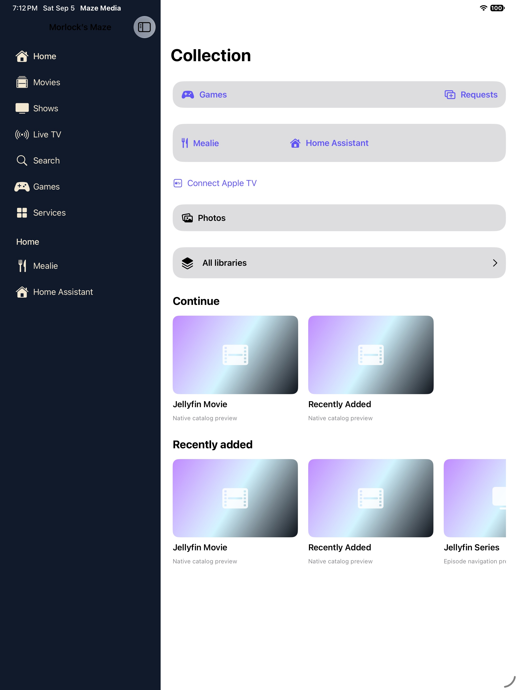
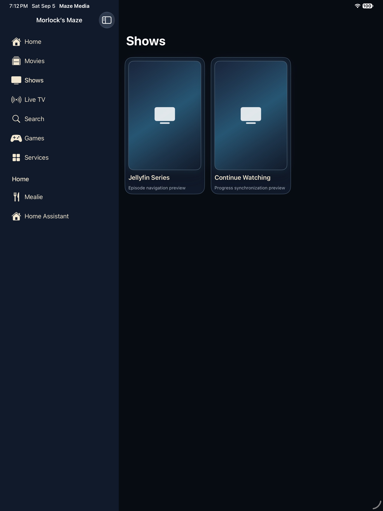
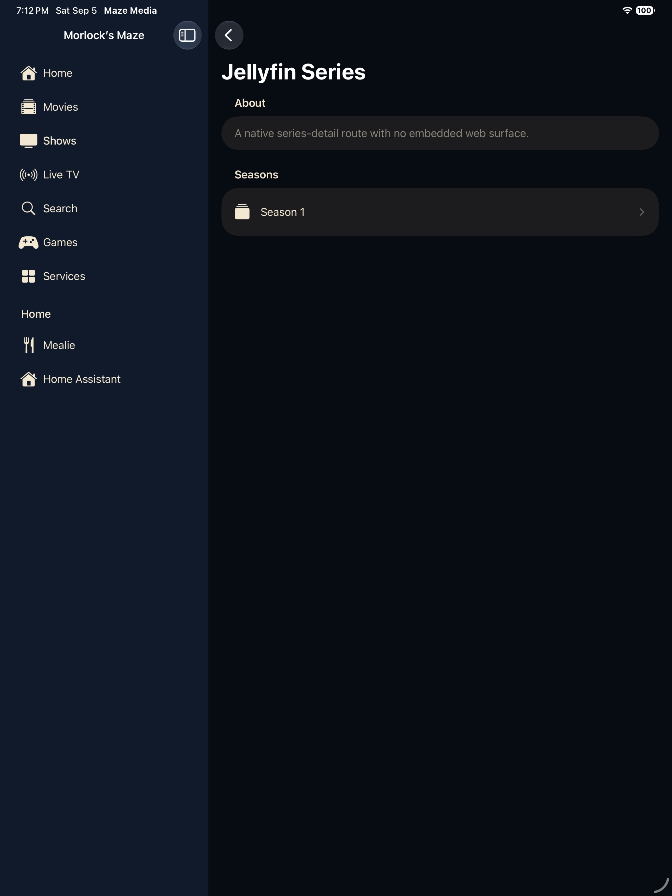

# iPad edition

> A persistent sidebar and wider content area for browsing and reading.

[Portfolio overview](../../README.md) · [Section plan](PLAN.md)

## Current design

The iPad shares the iOS application target and service model. Its sidebar exposes Home, Movies, Shows, Live TV, Search, Games and Services, with household shortcuts. Catalog and series detail views use the additional space. This is a device-specific presentation of the shared product, not a separate server stack.

## User journey

Sidebar → Shows → series → season → episode. Back returns through the content hierarchy without losing the sidebar. Service browser pages retain Back, Forward, Reload and Done.

## Design decisions

- Preserve library hierarchy and selected context.
- Use native collection/detail navigation and an explicit browser exit.
- Design for touch and pointer input without treating every large screen as an enlarged phone.

## Screen reference

*Simulator capture with demo content, September 5, 2026.*

*Simulator capture with demo content, September 5, 2026.*

*Simulator capture with demo content, September 5, 2026.*

*Simulator capture with demo content, September 5, 2026.*
