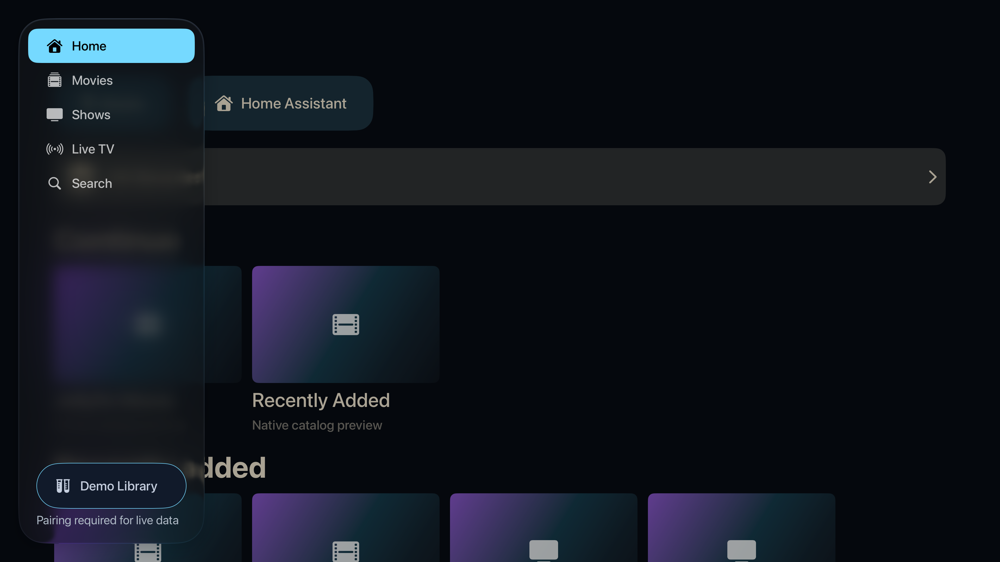

# Apple TV edition

> A native, remote-driven experience for shared viewing.

[Portfolio overview](../../README.md) · [Section plan](PLAN.md)

## Current design

Apple TV keeps five sidebar destinations: Home, Movies, Shows, Live TV and Search. Core media is negotiated through Jellyfin and played with AVKit. Home also opens native Mealie recipes and Home Assistant state views. The television application does not embed WebKit or a general-purpose browser.

## User journey

Move remote focus from the sidebar into content, choose a title or channel, and open the native player. Back returns to the prior view. Household access can be approved from an already approved iPhone or iPad using the TV’s temporary code.

## Design decisions

- Maintain native focus, selection and Back behavior.
- Admit a new TV feature only after its API, authentication, failure and physical interaction paths are proven.
- Keep game execution, full photo browsing, book reading and requests marked as pending TV counterparts.

## Screen reference

*Simulator capture with demo content, September 5, 2026.*
