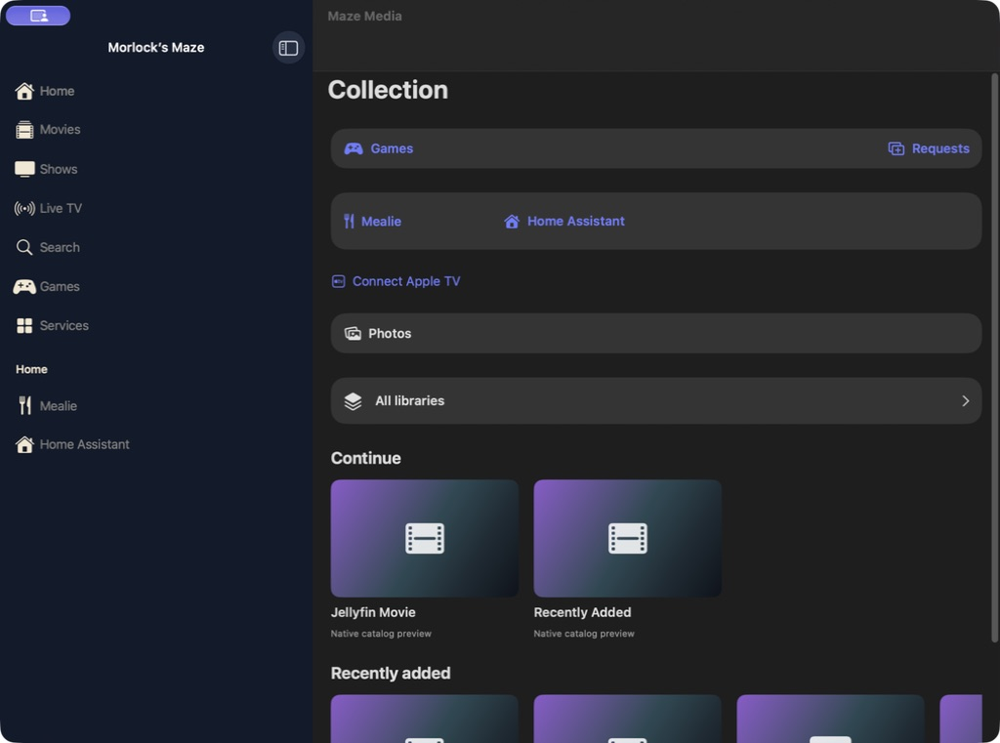

# Mac edition

> A desktop companion built from the shared iOS target with Mac Catalyst.

[Portfolio overview](../../README.md) · [Section plan](PLAN.md)

## Current design

The Mac edition brings the sidebar, native media player and service destinations into a resizable window. The locally delivered development build targets Apple silicon and macOS 14 or later; recorded runtime checks used macOS 27 beta. It is a signed local development application, not a notarized public download or a Mac App Store release.

## User journey

Choose a sidebar destination with the pointer, browse to an item and open playback. The controls panel provides transport, speed and sound controls. Close controls returns to the player; Done returns to the collection.

## Design decisions

- Use the existing shared source rather than fork a separate service stack.
- Pass the session explicitly into modal player presentations.
- Use the established audio-activation API off the main thread on Catalyst after the beta async path failed.

## Screen reference

*Mac runtime; isolated demo-content capture, September 6, 2026.*
