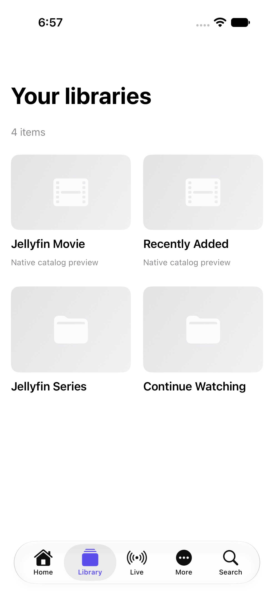
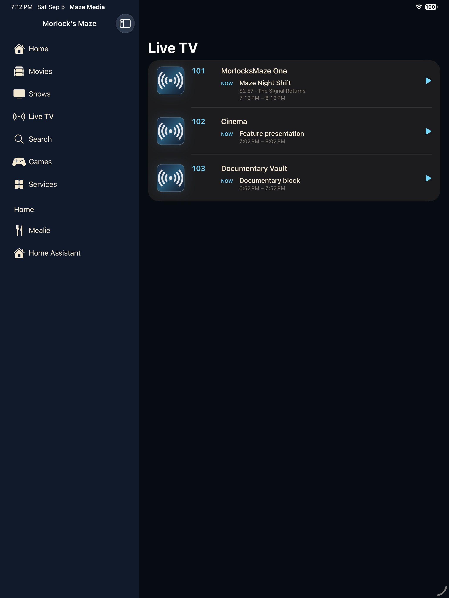

# Library, video, music & live TV

> One Jellyfin content model, with playback capabilities matched to each stream.

[Portfolio overview](../../README.md) · [Section plan](PLAN.md)

## Current design

Jellyfin owns the catalog, user session, playback negotiation and media delivery. The app preserves folders, collections, series, seasons and episodes. Music is a Jellyfin audio experience; Music Assistant integration is separate planned work. Saved videos in the owner’s Youtube folder use the same native playback path as other Jellyfin video.

## User journey

Browse or search → item details → direct or server-converted playback → progress checkpoint → return. Live TV follows the existing server chain: ErsatzTV schedule/playout → xTeVe tuner/guide bridge → Jellyfin → native Apple player.

## Design decisions

- Keep media bytes out of the JSON control-plane Gateway.
- Offer direct playback first and an explicit compatible-playback action.
- Only offer seeking inside the available range; live streams without DVR cannot rewind.
- Audio and subtitle choices depend on tracks actually delivered by the stream.

## Screen reference

*Simulator capture with demo content, September 5, 2026.*

*Simulator capture with demo content, September 5, 2026.*
