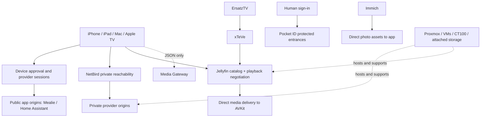

# Provider and route map

[Architecture](README.md) · [Identity](../11-identity/README.md)

This logical map describes the implementation checkpoint, not current reachability. The private baseline remains authoritative for actual addresses and policies.

| Service | App role | Route / identity at the recorded checkpoint | Boundary |
|---|---|---|---|
| Jellyfin | Video, series, music, saved videos and live TV | Configured HTTPS origin; per-user Quick Connect session | Direct provider media; no blanket off-VPN acceptance claim |
| ErsatzTV and xTeVe | Server-side live-channel generation and compatibility | Internal/operator service chain into Jellyfin | Apple clients do not bypass Jellyfin for normal playback |
| Immich | Native photo grid and asset detail | Private route; restricted per-device asset read/view key | Photo write-back and TV parity remain separate work |
| RomM | Game library and web runtime | Dedicated private app route; provider/proxy authorization | Test actual launch and input, not only page load |
| Jellyseerr | Discovery and requests | Dedicated private app route; provider/proxy authorization | Embedded browser on touch/Mac; native TV client pending |
| Mealie | Recipes | Device-authorized public app origin after enrollment | VPN-off Wi-Fi proof on iPhone/iPad |
| Home Assistant | Household states and supported controls | Device-authorized public app origin after enrollment | Scoped sessions; TV actions confirm before execution |
| Pocket ID | Human sign-in to protected entrances | Existing OIDC/passkey identity service | Not a universal media API token |
| NetBird | Private peer/network reachability | Existing private connectivity and DNS/policy configuration | A connected VPN alone does not prove service authorization |
| Media Gateway | Coordination and contracts | JSON control plane | Never carries video or photo bytes |
| Kavita / Audiobookshelf / Music Assistant | Future reading, listening and speaker capabilities | Existing server inventory; app contracts pending | Server availability is not feature completion |

## Logical flow

## Baseline handling

The September 4, 2026 network baseline was retrieved on September 5. Later app-specific routes and device approval work are described by the implementation ledger. A declared entrance is not proof of native API access, current authentication policy, or successful playback. This public edition omits the private Google Drive link, IP inventory, management endpoints, device identifiers and secret material.

NetBird documentation reviewed on September 6 describes **Networks** as the model for new configurations and marks legacy Routes deprecated. This is a planning input; this documentation task does not migrate the existing network. See [NetBird routing documentation](https://docs.netbird.io/manage/network-routes).
