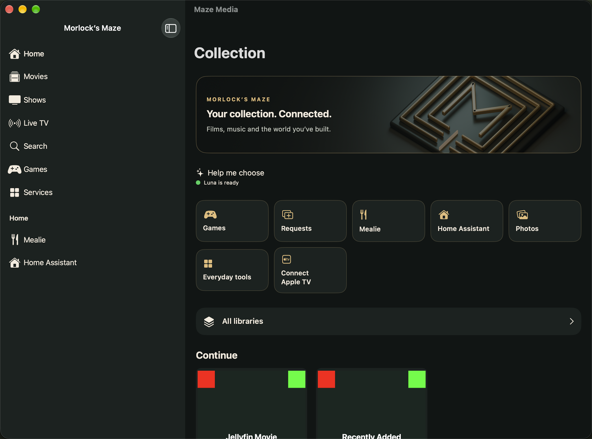
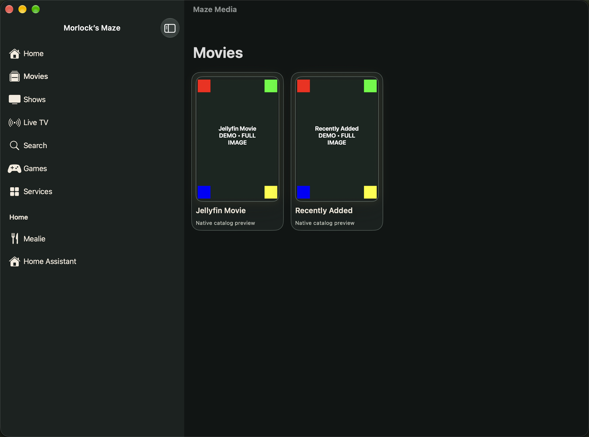
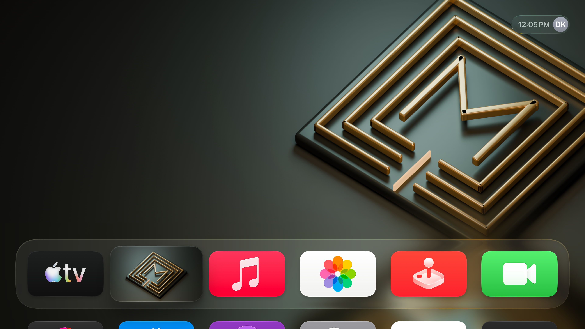

# Build 17 · Release qualification

**September 7, 2026 — version 1.0.1 (17), candidate. Not uploaded to TestFlight.**

Home now publishes available Jellyfin content while the live guide continues loading. Apple TV begins preparing its local Top Shelf cache at that point and falls back to movies when recent items contain no playable artwork. This change addresses the observed empty shelf; physical dynamic preview and selection checks remain required.

## Verification

| Layer | Current evidence |
|---|---|
| Backend | 62 tests passed; four approved public service routes passed authentication and isolation checks |
| Luna public route | Readiness and both allowed reasoning modes passed; synthetic request timings were 2.400 s and 1.981 s |
| Mac application | 77 tests passed; Requests loaded; window screenshots captured and reviewed |
| iPad service views | Mealie, Home Assistant, Requests and RomM loaded on the preceding installed build; this is not build 17 acceptance |
| Provider setup | Jellyfin automatic enrollment passed; photo metadata loaded but 0 of 10 sampled thumbnails were readable |
| Signed archives | iOS, tvOS and Mac Catalyst archives succeeded |
| Local delivery | Mac build 17 installed and launched; iPhone build 17 installed; mobile/TV final interaction checks remain pending |
| Apple TV Top Shelf | Branded static artwork observed with Maze Media selected in the top row; dynamic Jellyfin cards and playback not yet confirmed |
| TestFlight | Latest directly checked iOS and tvOS release is 1.0.0 (13), Testing. General beta descriptions and the GitHub link were saved; build 17 has not been uploaded |

The iPhone retest lost its test-runner connection before launch. The iPad and Den Apple TV subsequently became unavailable to Xcode. These are incomplete checks, not passes.

## Mac · Home

The desktop sidebar provides media navigation and household destinations. This is a real build 17 window capture using synthetic QA content. It verifies presentation, not access to a private collection.

## Mac · Movies

Colored corner markers make image cropping visible. All four markers remain within each portrait card. The fixture titles are short, so this capture does not independently prove long-title behavior.

## Apple TV · Static shelf checkpoint

This physical capture predates the build 17 loading fix. It confirms the branded static shelf only. It is deliberately not presented as dynamic Jellyfin preview evidence.

## Service issue under investigation

Immich’s missing background worker has been restored using the exact pinned server version, with CPU and memory limits and no public port. The existing thumbnail backlog is shrinking. Three processed samples and an approved-device public photo canary now return valid images. The original ten recent records still await derivatives, so photo recovery remains in progress.

The broader whole-catalogue Luna relay remains gated. Build 17 retains the previously admitted bounded discovery behavior, with Quick/Consider modes and a backend-held key.

[Image provenance and hashes](screenshots.json) · [Portfolio](../../../README.md)
