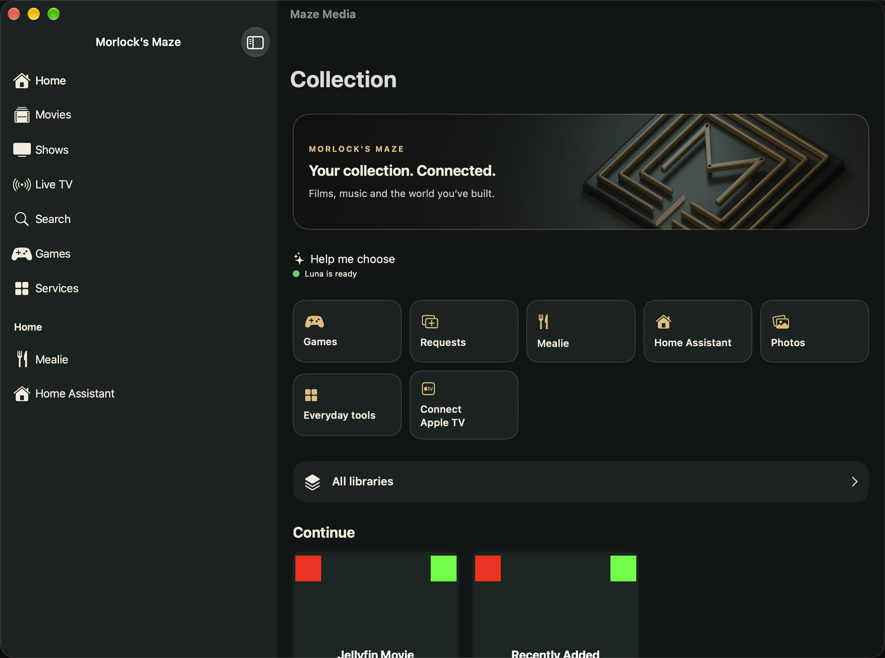
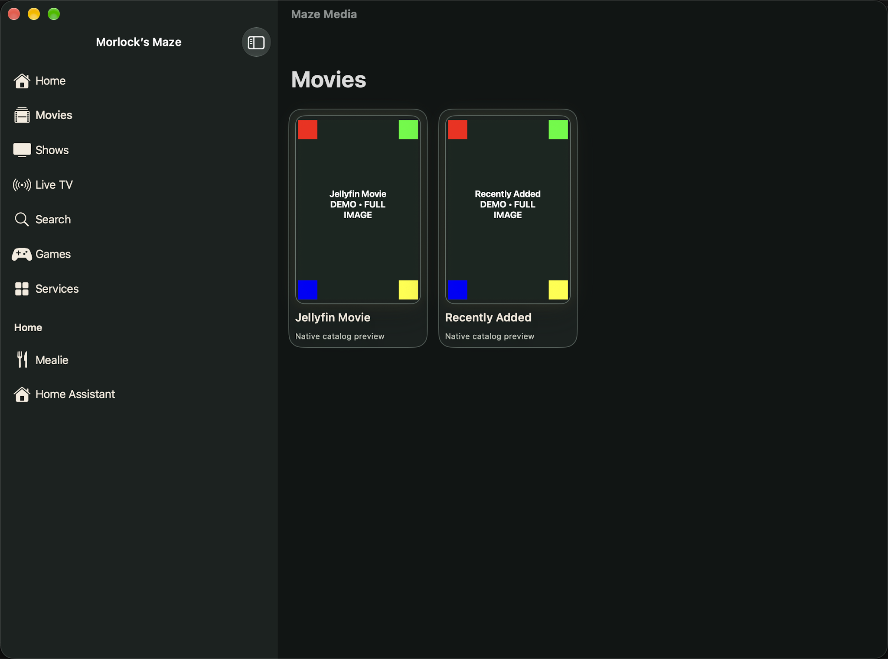

# Build 18 · Live-TV startup repair

**September 7, 2026 · Version 1.0.1 (18) · Development candidate**

Jellyfin live television could time out before its first media playlist was ready. The shared Apple-platform client now waits for the initial same-server playlist before opening AVPlayer. Media continues directly from Jellyfin. Ordinary movies and saved videos retain their existing playback path.

The real Mac live-channel check passed: video advanced, pause held position, resume advanced again, and Done closed the player. This verifies a short playback flow, not every channel or a long playback session.

| Check | Verified result |
| --- | --- |
| Shared package | 51 tests passed |
| Mac app and standard controls | 76 passed; two opt-in tests skipped; zero failures |
| Real Mac live-channel controls | One separate test passed |
| Signed development builds | iOS/iPadOS, tvOS and Mac Catalyst passed using Xcode 27 beta 6 |
| Installation | Build 18 installed on Mac and iPhone |
| Home and Movies capture test | Passed; fresh application-window captures below |
| iPad and Apple TV installation | Pending; devices unavailable remotely |
| Dynamic Apple TV Top Shelf | Physical artwork and selection-to-playback still pending |
| TestFlight | Build 18 not uploaded or processed |

## Home

The shared theme provides direct access to Games, Requests, Mealie, Home Assistant, Photos and Everyday tools. The Luna readiness indicator shown here is a **fixture state**, not evidence of a live provider check.

## Movies

Synthetic artwork uses four colored corners to expose clipping. All four corners are visible in these movie cards. These are quality-assurance captures rather than screenshots of the owner's private collection. [Capture provenance and hashes](screenshots.json) identify the exact files.

## Release remains in qualification

The owner is away. Physical iPhone/iPad/Apple TV checks, dynamic Top Shelf playback and the recent-photo sample remain open. Immich thumbnail backlog recovery and service acceptance retain the qualifications in the [build 17 record](../build-17/README.md). Expanded whole-catalogue Luna remains gated.

No new TestFlight availability is claimed. Previously exported build 17 packages predate this repair. The implementation and test evidence are maintained in the [private source repository](https://github.com/Morlock52/morlocksmaze-media/tree/codex/luna-discovery/docs/release/1.0.1-build-18).
