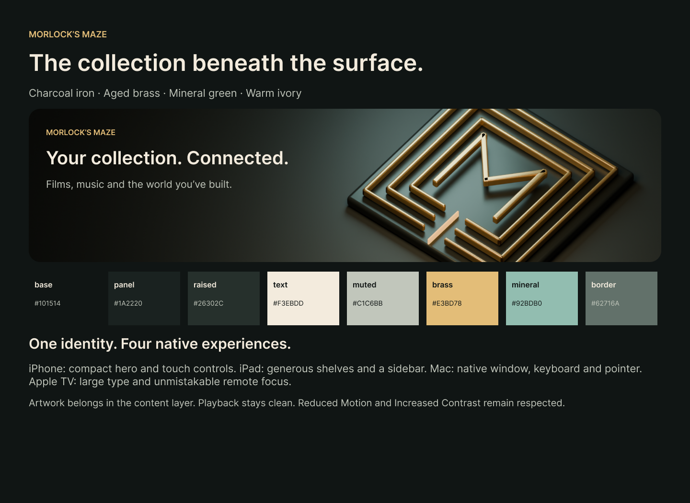

# Morlock’s Maze · Brass Labyrinth

Build 13 · September 6, 2026

A shared identity for iPhone, iPad, Mac and Apple TV: charcoal iron, aged brass, mineral green and ivory. An original three-dimensional M sits inside a geometric labyrinth. The design draws on the subterranean industrial world of Wells’s Morlocks while keeping navigation familiar and readable.

[Editable Figma design and platform captures](https://www.figma.com/design/sfpDlUVIM1j8i4wZ1wjCBC?node-id=8-12) · [Research and design decisions](report-source.md) · [Release evidence](VERIFICATION.md) · [Section plan](PLAN.md)

## Platform expression

| Edition | Theme behavior | Capture |
|---|---|---|
| iPhone | Adaptive service grid, native tabs, static architectural header | [Capture](iphone-home.png) · [Figma](https://www.figma.com/design/sfpDlUVIM1j8i4wZ1wjCBC?node-id=12-2) |
| iPad | Persistent sidebar, wider shelves and scalable service labels | [Capture](ipad-home.png) · [Figma](https://www.figma.com/design/sfpDlUVIM1j8i4wZ1wjCBC?node-id=14-2) |
| Mac | Catalyst sidebar and pointer navigation, matching content surfaces | [Capture](mac-home.png) · [Figma](https://www.figma.com/design/sfpDlUVIM1j8i4wZ1wjCBC?node-id=12-5) |
| Apple TV | Five native destinations, remote focus with dark text on brass, household entry points | [Capture](tvos-home.png) · [Figma](https://www.figma.com/design/sfpDlUVIM1j8i4wZ1wjCBC?node-id=12-8) |

The shared palette reaches native content, legacy semantic theme adapters, the audio player and household selections. Actual provider artwork keeps priority; the generated architecture appears behind the media-type symbol only when artwork is absent. Video receives no decorative overlay. Reduce Transparency uses an opaque header surface.

## Original assets

- [Blender source](MorlocksMaze.blend) and [scene renderer](render_maze.py).
- [Architectural header](maze-architecture.png) and [maze emblem](maze-emblem.png), rendered from the original scene.
- [Image-generation prompt and provenance](IMAGE_PROMPT.md). No runtime image-generation or assistant API is included.

The theme changes appearance, not service authorization or media routing. Jellyfin remains the video source; household and game functionality retain the previously implemented platform boundaries. This release is not a claim that every content type works on every platform.
